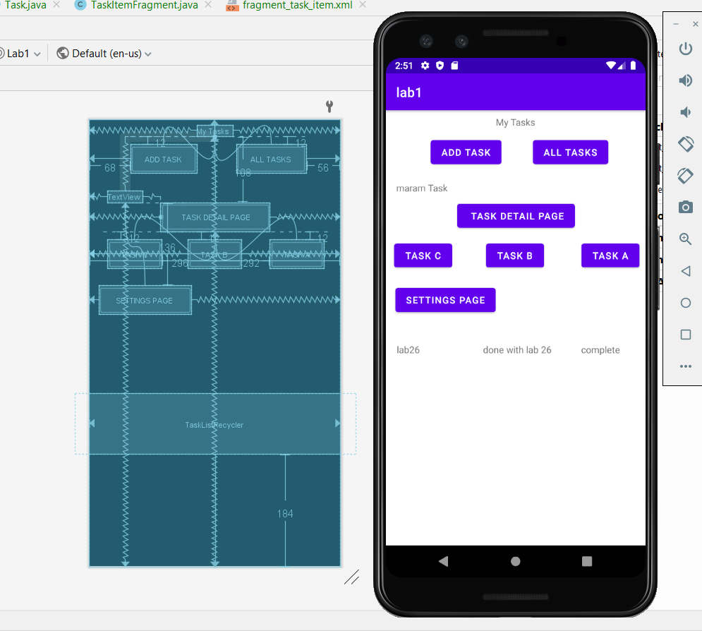

# TaskMaster

## feature tasks (lab 26)

1. Home page: this page containe a header, and there is an image in the center of the page, and it's contane two buttons (add task , all task) each button will guide to different page

2. Add task Page: in this page there is a two plain text to enter the title and description for task, after fill the fields and click on add task it will show a msg submitted!

3. All tasks page: this page contain all tasks, and the button home (to back to the home page)

## feature tasks (lab 27)

1. add button Task detail page when click on it it will display general page 
2. add three buttons in home page each button represent one tasks when click on one button it will display the name of the task in the top of the page 
3. add button for settings page to guide to the settings

- general page to  Task Detail 

- Actevity of Task A

- Actevity of Task B

- Actevity of Task C

1. Activety for settings page it's include a box to add username and the save button 
2. after add username and click on save it's will display it in the home page

- add user name

- display user name with tasks

## feature tasks (lab 28)
- Add a RecyclerView, its away of create a partial UI can use over and over can use it inside application
- Represent all tasks

## feature tasks (lab 29)
- Add DataBase and save tasks inside it 

- when click on task inside list it will guide to the details page thats include Body (descreption) of the task

## feature tasks (lab 31)
- in this lab just added the test for activeties and some buttons 
- the first thing test if when click on sitting and enter name it will show in the main activety 
- check if the setting page button it self is display or not
- check if when click on the item in the recyclerview it will show the detail page or not 

## feature tasks (lab 31)
- in this lab using AWS to save data in database

